# Hi 👋, I'm Jacob Tanner

<!--
**jtann5/jtann5** is a ✨ _special_ ✨ repository because its `README.md` (this file) appears on your GitHub profile.

Here are some ideas to get you started:

- 🔭 I’m currently working on ...
- 🌱 I’m currently learning ...
- 👯 I’m looking to collaborate on ...
- 🤔 I’m looking for help with ...
- 💬 Ask me about ...
- 📫 How to reach me: ...
- 😄 Pronouns: ...
- ⚡ Fun fact: ...
-->

I’m a graduate student and teaching assistant pursuing a Master’s in Computer Science at [Montana State University](https://montana.edu), with interests in software engineering, cybersecurity, infrastructure, and web development. Through hands-on projects, group collaboration, and academic study, I’ve built software systems, designed and maintained secure, reliable infrastructure, and applied formal, algorithmic reasoning to real-world problems. I’m committed to growing into an engineer who builds impactful technology that meaningfully improves people’s lives.

### 💻 Languages

### 🛠️ Technologies & Tools

### 📊 GitHub Stats

